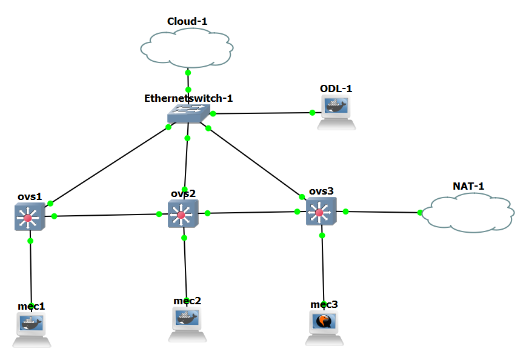

## This is a property of London South Bank University licensed under the Creative Commons Attribution-NonCommercial-ShareAlike 4.0 International (CC BY-NC-SA 4.0)

### Please get proper permission before use

### @Author: Emeka Ugwuanyi ugwuanye@lsbu.ac.uk with contributions from Saptarshi Ghosh
### GNS3 Architecture

### Docker Linux Use instructions
#### Prior to Download
* change your docker root password
* install sudo in your docker
* add a new user in your linux with the following details:
- username: mec
- password: password
* usermod -aG sudo mec
* then clone the folder into the mec directory 
#### After Download 
* Change directory to ./caching_project and Run set_up.sh as sudo
* Start your ssh server
* You will require a web server, make sure it is running
* choose any of the algorithm and run it
* there are 4 caching co-operative algorithms with each having a gui version with shows realtime graphs
* always run gui version as sudo
* You will be required to put the following:
- ip address of the webserver
- number of requests (default is 30)
- number of html contents (choose from 7 to 20). 7 is default
* After each run; run the files_cache/refresh_db.py file to refresh the database and clean up residual files

### Any other Linux device 
* install sudo
* add a new user in your linux with the following details:
- username: mec
- password: password
* usermod -aG sudo mec
* then clone the folder into the mec directory 
#### After Download 
* Change directory to ./caching_project and Run set_up.sh as sudo
* Start your ssh server
* You will require a web server, make sure it is running
* choose any of the algorithm and run it
* there are 4 caching co-operative algorithms with each having a gui version with shows realtime graphs
* always run gui version as sudo
* You will be required to put the following:
- ip address of the webserver
- number of requests (default is 30)
- number of html contents (choose from 7 to 20). 7 is default
* After each run; run the files_cache/refresh_db.py file to refresh the database and clean up residual files


__________________________________________________
```
apt update  
passwd   
password   
password   
apt install git sudo -y  
adduser mec  
password  
password  
usermod -aG sudo mec  
su - mec  
git clone https://github.com/emylincon/caching_project.git  
cd caching_project  
sudo bash set_up.sh  
password
```
